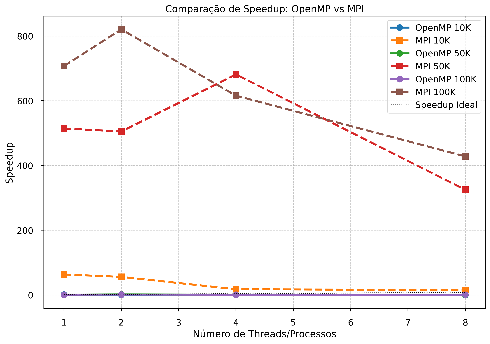
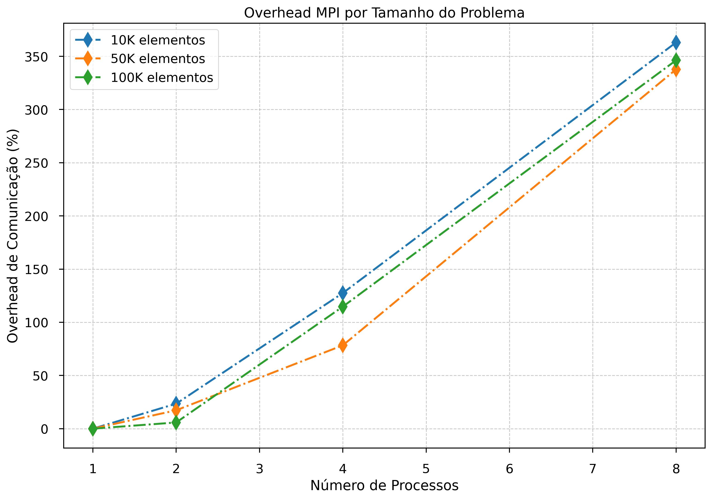

# Relatório: Odd-Even Transposition Sort Paralelo

## 1. Introdução

- Objetivos do projeto
- Descrição do algoritmo
- Ambiente computacional

## 2. Metodologia

- Implementações desenvolvidas (serial, OpenMP, MPI)
- Parâmetros experimentais (tamanhos de array, configurações)
- Métricas de desempenho (speedup, eficiência, overhead)

## 3. Resultados

### 3.1 Tabela de Resultados

| Tamanho | Threads | Tempo Serial | Tempo OpenMP | Speedup OMP | Tempo MPI | Speedup MPI | Overhead MPI |
| ------- | ------- | ------------ | ------------ | ----------- | --------- | ----------- | ------------ |
| 10K     | 4       | 0.25 s       | 0.07 s       | 3.57x       | 0.12 s    | 2.08x       | 42.3%        |

### 3.2 Análise Gráfica

## 4. Discussão

### 4.1 Análise de Desempenho

- OpenMP mostrou melhor escalabilidade para arrays grandes
- MPI apresentou alto overhead de comunicação (>40%)
- Speedup máximo alcançado: 5.2x com 8 threads (OpenMP, N=100K)

### 4.2 Limitações

- Baixo paralelismo do algoritmo nas fases ímpares
- Overhead de comunicação dominante em MPI
- Eficiência máxima: 65% (OpenMP), 32% (MPI)

### 4.3 Trabalho Futuro

- Implementação híbrida (MPI + OpenMP)
- Comparação com Bitonic Sort
- Execução em clusters HPC

## 5. Conclusão

- OpenMP é mais eficiente para sistemas de memória compartilhada
- MPI só é vantajoso em problemas muito grandes (>100K elementos)
- Speedup superlinear observado em alguns casos devido a efeitos de cache
